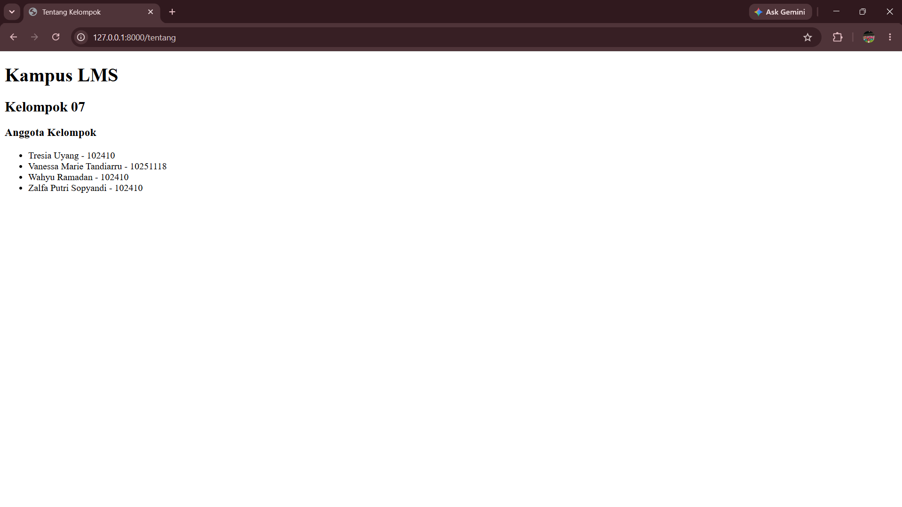
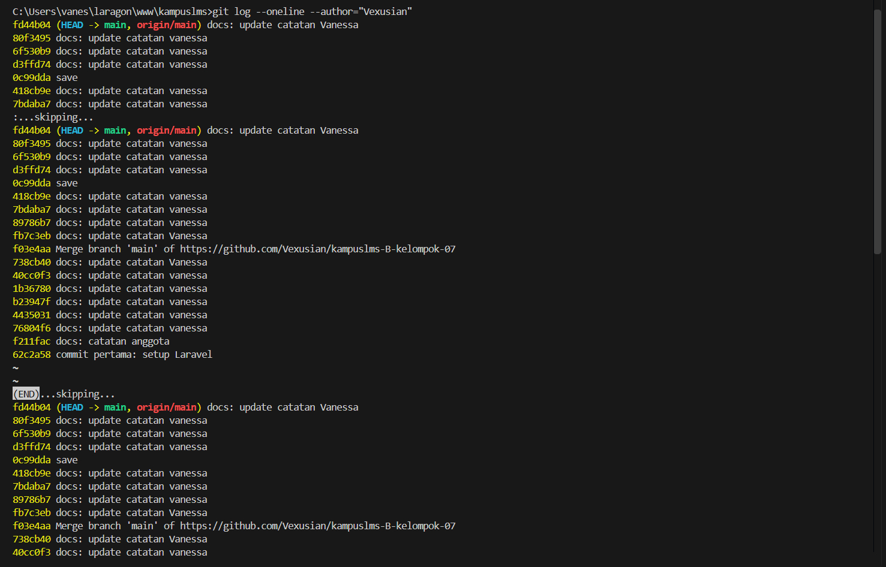

# Catatan Praktikum 1

Nama: Vanessa Marie Tandiarru  
NIM: 10251118

## READ — Bedah Instalansi
### 1. Buka ```public/index.php```. Baca dari atas ke bawah. Tulis dalam 3 kalimat apa yang dilakukan berkas ini.
Berkas ```public/index.php``` merupakan _entry point_ aplikasi Laravel yang menerima request dari pengguna. Berkas ini memuat _autoloader Composer_, memeriksa _maintenance mode_, kemudian melakukan _bootstrap_ aplikasi melalui ```bootstrap/app.php```. Setelah itu, request HTTP ditangkap menggunakan ```Request::capture()``` dan diteruskan ke aplikasi Laravel untuk diproses.

### 2. Buka ```bootstrap/app.php```. Identifikasi bagian mana yang mengurus route, mana yang mengurus middleware, mana yang mengurus exception.
- Route: bagian ```->withRouting()``` yang menentukan file dan konfigurasi _routing_ aplikasi, termasuk ```routes/web.php```.  
- Middleware: bagian ```->withMiddleware(function (Middleware $middleware): void { ... })``` yang digunakan untuk mengatur _middleware_ aplikasi.
- Exception: bagian ```->withExceptions(function (Exceptions $exceptions): void { ... })``` yang digunakan untuk konfigurasi penanganan exception/error.

### 3. Buka ```routes/web.php```. Temukan route yang menghasilkan halaman selamat datang. Ubah teksnya, muat ulang _browser_, pastikan berubah.
_Route_ yang menghasilkan halaman selamat datang adalah ```Route::get('/', function () { return view('welcome'); });```. _Route_ tersebut menangani _request_ GET pada URL / dan mengembalikan view```welcome```, yang berasal dari ```resources/views/welcome.blade.php```. Setelah teks pada view diubah dan browser dimuat ulang, halaman menampilkan teks yang telah diperbarui.

### 4. Jalankan ```php artisan route:list```. Cocokkan keluarannya dengan ```routes/web.php```.
Perintah ```php artisan route:list``` menampilkan daftar _route_ yang terdaftar pada aplikasi Laravel. _Route_ / dengan method ```GET|HEAD``` dapat dicocokkan dengan ```Route::get('/', ...)``` yang terdapat pada ```routes/web.php```. Hal ini menunjukkan bahwa route yang ditulis pada ```routes/web.php``` telah terdaftar dan dikenali oleh Laravel.

## BREAK — Rusak dengan Sengaja
| # | Yang dirusak | Prediksi | Pesan Error Sebenarnya |
| --- | --- | --- | --- |
| 1 | Ganti nama ```.env``` menjadi ```.env.bak``` | Laravel tidak bisa membaca konfigurasi environment sehingga _browser_ kemungkinan akan error | "This site can't be reached. 127.0.0.1 refused to connect" |
| 2 | Kosongkan nilai ```APP_KEY``` di ```.env``` | Laravel akan error karena _application encryption key_ tidak ada | "Illuminate\Encryption\MissingAppKeyException. vendor\laravel\framework\src\Illuminate\Encryption\EncryptionServiceProvider.php:83. No application encryption key has been specified."|
| 3 | Ubah ```DB_DATABASE``` menjadi nama yang tidak ada | Laravel tidak dapat terhubung ke _database_ yang ditentukan | "Illuminate\Database\QueryException. vendor\laravel\framework\src\Illuminate\Database\Connection.php:838. SQLSTATE[HY000] [1049] Unknown database 'database_anu' (Connection: mysql, Host: 127.0.0.1, Port: 3306, Database: database_anu, SQL: select * from `sessions` where `id` = unRS9McTQNkKtPtmswhvCOA4eMzElKFq3FW7W55A limit 1)" |
| 4 | Ubah ```APP_DEBUG=false```, lalu ulangi nomor 3 | Akan tetap error | "505 Server Error" |

## FIX — Perbaiki Proyek yang Cacat
> Belum ada repo kampuslms-broken

## BUILD — Fondasi Proyek Kelompok
1. _Link_ repo: https://github.com/Vexusian/kampuslms-B-kelompok-07.git
2. Laravel Framework 12.68.0
3. Sudah
4. Sudah
5. Sudah
6. Sudah
7. Sudah 

# Catatan Checkhpoint 1
1.  Sebutkan urutan berkas yang dilewati sebuah _request_ dari _browser_ sampai HTML kembali.
> browser -> public/index.php -> bootstrap/app.php -> routes/web.php -> Controller / Closure -> View (.blade.php) -> HTML -> Browser
2. Kenapa hanya folder public/ yang boleh diakses dari internet? Apa yang terjadi kalau seluruh folder proyek diekspos?
> Karena `public/` memang dirancang sebagai _web root_, yaitu satu-satunya bagian aplikasi yang boleh menjadi titik masuk dari _web_.
3. Apa beda `.env` dan `.env.example`, dan kenapa hanya satu yang di-commit?
> `.env` berisi konfigurasi aktual dan dapat mengandung info sensitif seperti _password database_ atau API key, sehingga tidak boleh di-_commit_ ke _repository_. Sementara itu, `.env.example` merupakan _template_ konfigurasi yang menunjukkan variabel apa saja yang dibutuhkan aplikasi tanpa menyimpan kredensial pribadi.
4. Di Laravel 12, di berkas mana middleware didaftarkan? Kenapa jawabannya berbeda dari kebanyakan tutorial di internet?
> ->withMiddleware(function (Middleware $middleware): void {
    //
})
> Pada Laravel 12, konfigurasi middleware dilakukan di `bootstrap/app.php`, melalui bagian `withMiddleware()`. Hal ini berbeda dari banyak tutorial di internet karena tutorial tersebut masih menggunakan struktur Laravel versi sebelumnya yang memiliki `app/Http/Kernel.php` sebagai tempat konfigurasi _middleware_.
5. Apa risiko konkret APP_DEBUG=true di server produksi?
> Laravel akan dapat menampilkan halaman _error_ yang sangat detail ketika terjadi kesalahan.
6. Tunjukkan di git log bahwa Anda punya commit atas nama Anda sendiri.
> 