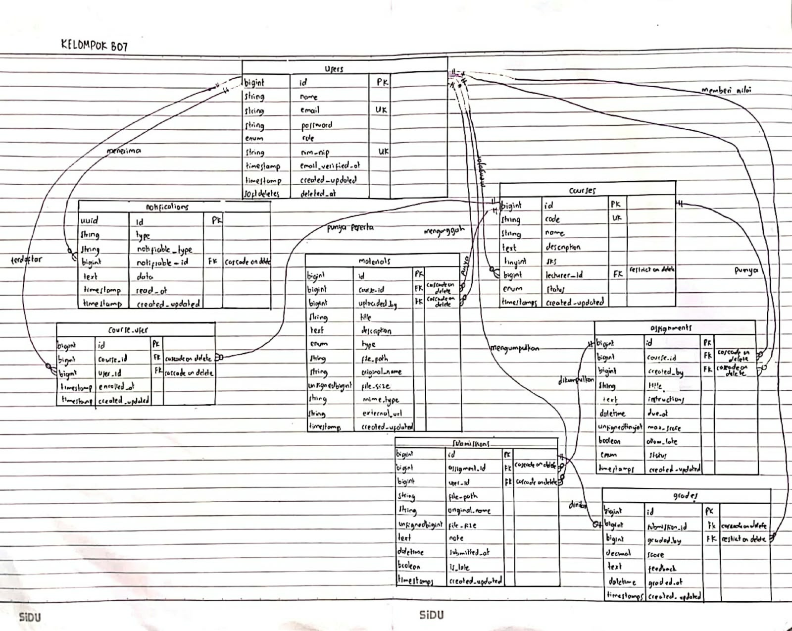

# Catatan Praktikum 

Nama: Vanessa Marie Tandiarru  
NIM: 10251118

## READ — Baca Skema Sebelum Menulisnya
1. Gambar ulang ERD dari spesifikasi di papan/kertas, tanpa melihat dokumen.
> 
2. Untuk setiap foreign key, tentukan perilaku onDelete-nya dan tuliskan alasannya.

| No. | Entitas (Induk) | Entitas (Anak) | Perilaku OnDelete | Alasan |
|---:|---|---|---|---|
| 1 | User | Notifications | `cascadeOnDelete` | Jika User dihapus maka user tidak perlu lagi mendapatkan notifikasi. |
| 2 | User | Courses | `restrictOnDelete` | Selama dosen memiliki mata kuliah diampu maka dosen tidak boleh dihapus. |
| 3 | User | Grades | `restrictOnDelete` | Akun user (dosen) harus tetap ada agar siapa yang menilai bisa tetap terlihat. Selagi atribut `graded_by` masih ada karena atribut tersebut mereferensi ke user. |
| 4 | User | Course User | `cascadeOnDelete` | Jika user mahasiswa dihapus maka `course_user` tidak masalah terhapus. |
| 5 | User | Material | `cascadeOnDelete` | Jika User dosen dihapus maka materi ikut terhapus. |
| 6 | Courses | Assignment | `cascadeOnDelete` | Jika mata kuliah dihapus maka tugas yang diberikan juga ikut terhapus. |
| 7 | `course_user` | Courses | `cascadeOnDelete` | Jika mata kuliah dihapus maka `course_user` akan ikut terhapus, karena mata kuliah itu tidak bisa lagi diambil user. |
| 8 | Courses | Material | `cascadeOnDelete` | Jika mata kuliah dihapus maka material juga ikut dihapus karena sudah tidak dipakai. |
| 9 | Assignment | Submission | `cascadeOnDelete` | Jika assignment dihapus maka submission akan ikut dihapus, karena pengumpulan tugas tidak akan berguna jika penugasannya tidak ada. |
| 10 | Submission | Grades | `cascadeOnDelete` | Jika submission dihapus maka grades sudah tidak diperlukan lagi dan perlu dihapus. |
| 11 | Users | Submissions | `cascadeOnDelete` | Jika user mahasiswa dihapus maka submission yang dikumpulkan oleh user tersebut juga ikut dihapus karena submission tersebut tidak lagi memiliki pemilik/pengumpul. |
3. Jawab: kalau seorang dosen dihapus, apa yang terjadi pada mata kuliahnya? Kenapa dirancang begitu?
> Jika mengikuti rancangan yang telah dibuat, maka penghapusan entitas Dosen tidak diizinkan karena perilaku OnDelete-nya adalah Restrict On Delete. Namun jika dengan terpaksa dilakukan force delete, maka Mata Kuliah sebagai entitas anak akan menjadi data yang ‘yatim piatu’ (Orphaned Data) karena tidak memiliki induk.
4. Jawab: kenapa `grades.submission_id` bersifat unique, bukan sekadar index biasa?
> `grades.submission_id` harus dibuat unik karena penilaian untuk satu submission hanya boleh memiliki 1 nilai. jika tidak dibuat unik, maka memungkinkan untuk satu submission mendapatkan banyak nilai. 

## BREAK — Lima Kerusakan

| # | Yang Dicoba | Prediksi | Hasil Pengamatan Riil |
|---|-------------|----------|------------------------|
| **1** | Hapus `unique(['course_id','user_id'])` dari `course_user`, lalu daftarkan mahasiswa yang sama dua kali | Data ganda akan lolos tanpa penolakan | **Terbukti**: Query `insert` kedua berhasil tanpa error (`[2] Insert kedua BERHASIL (DUPLIKAT LOLOS!)`). Mahasiswa yang sama terdaftar dua kali pada mata kuliah yang sama. |
| **2** | Tambahkan `role` ke `$fillable` model `User`, lalu kirim request pembuatan user dengan `role=admin` lewat form/request tanpa field role | User baru berhasil mendapatkan hak akses admin (eskalasi hak akses) | **Terbukti**: Eloquent menyimpan data `role` menjadi `'admin'`. Field yang diselundupkan penyerang berhasil masuk ke database karena `$fillable` bocor. |
| **3** | Ganti seluruh `$fillable` dengan `protected $guarded = [];` lalu ulangi nomor 2 | Seluruh proteksi mass assignment mati dan semua atribut bisa dimanipulasi | **Terbukti**: User tersimpan dengan `role = 'admin'`. Menggunakan `$guarded = []` mematikan total proteksi Eloquent terhadap input berbahaya. |
| **4** | Kosongkan isi `down()` di migrasi `create_grades_table`, lalu jalankan `php artisan migrate:refresh` | Proses rollback atau migrasi ulang gagal karena tabel tidak terhapus | **Terbukti**: `migrate:refresh` menghasilkan error `FAIL` pada tabel induk `submissions` (`SQLSTATE[HY000]: Cannot drop table 'submissions' referenced by a foreign key constraint 'grades_submission_id_foreign' on table 'grades'`). Migrasi menjadi tidak reversible dan merusak pipeline CI/CD. |
| **5** | Ubah `restrictOnDelete` pada `lecturer_id` menjadi `cascadeOnDelete`, lalu hapus satu dosen pengampu | Mata kuliah yang diampu dosen akan ikut terhapus otomatis (*data loss*) | **Terbukti**: Saat dosen dihapus (`forceDelete`), database secara otomatis menghapus baris mata kuliah pada tabel `courses` (`BENCANA CASCADE: Mata Kuliah ikut TERHAPUS OTOMATIS!`), beserta data turunannya. |

### Detail & Bukti Pengujian:
1. **Break 1 (Unique Composite `course_user`)**:
   - Saat normal: melempar `QueryException: 1062 Duplicate entry '1-5' for key 'course_user_course_id_user_id_unique'`.
   - Saat rusak: data duplikat berhasil tersimpan. Database constraint adalah benteng terakhir menghadapi *race condition*.
2. **Break 2 & 3 (Mass Assignment & `$guarded = []`)**:
   - Saat normal: `User::create([... 'role' => 'admin'])` mengabaikan `role` sehingga user tetap dibuat dengan role default `mahasiswa`.
   - Saat `$fillable` bocor atau `$guarded = []`: role tersimpan menjadi `admin`. Token CSRF tidak melindungi dari mass assignment karena CSRF hanya memverifikasi asal request, bukan menyaring payload.
3. **Break 4 (Reversibilitas Migrasi)**:
   - Method `down()` yang kosong meninggalkan tabel `grades` saat rollback, sehingga tabel `submissions` yang dirujuk foreign key gagal di-drop.
4. **Break 5 (Perilaku Foreign Key OnDelete)**:
   - Pada `restrictOnDelete`, database menolak penghapusan dosen dengan error `1451 Cannot delete or update a parent row: foreign key constraint fails`.
   - Pada `cascadeOnDelete`, seluruh mata kuliah dosen langsung lenyap seketika, membuktikan bahaya cascade pada entitas dosen.

# Checkpoint
1.  Tunjukkan migrasi yang Anda tulis. Jelaskan setiap constraint di dalamnya.
2. Kenapa course_user punya unique composite? Peragakan apa yang terjadi kalau dihapus.
3. Apa itu mass assignment? Tunjukkan di kode Anda apa yang mencegahnya, lalu peragakan serangannya dengan curl.
4. Kenapa role tidak boleh ada di $fillable? Di mana ia diisi sebagai gantinya?
5.  Kenapa lecturer_id memakai restrictOnDelete sementara materials.course_id memakai cascadeOnDelete?
6.  Jalankan php artisan migrate:refresh di depan penguji. Harus berhasil tanpa error.
7. Tunjukkan satu bagian kode yang Anda tulis dengan bantuan AI. Apa yang Anda ubah dari keluaran aslinya, dan kenapa?